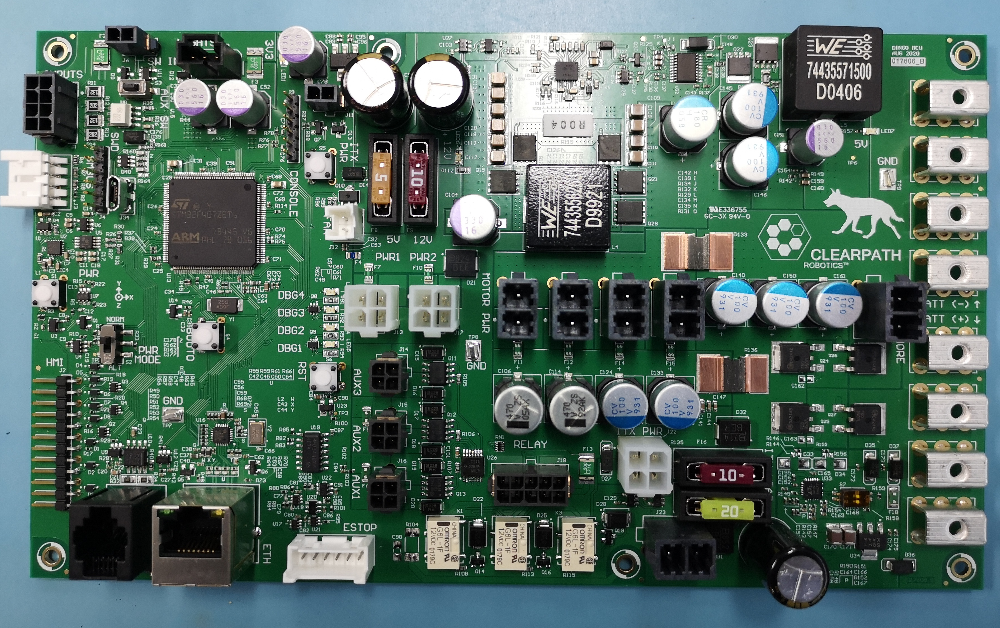

Adding Payloads
================

Dingo's base platform does not include any sensors by default, though Dingo can support a wide array of ROS-capable
peripherals.

This section is not intended to be an exhaustive list of all supported payloads, but rather offer general guidance
on how payloads should be connected to the robot.

Powering Payloads
------------------

Many payloads, such as sensors, arms, and network switches require external power.  Dingo's MCU is equipped with
3 auxiliary outputs which can be used to power these payloads:

======  ======================  =======================
AUX #   Voltage                 Current Limit
======  ======================  =======================
AUX1    12-14V (unregulated)    20A
AUX2    12V (regulated)         10A total, 8A per pin
AUX3    5V (regulated)          5A
======  ======================  =======================

``AUX1`` is connected directly to Dingo's batteries, like ``VBATT``.  This will provide 12-14V when the batteries are
fully-charged, but can be expected to drop steadily as the robot is used.  Payloads that are not tolerant to variable
input voltage should not be connected to ``AUX1``.

Payloads may also be connected to ``PWR1`` or ``PWR2``:

======  ======== ======================
Pin #   Pinout   Current Limit
======  ======== ======================
1       12V      10A total, 8A per pin
2       5V       5A
3       gnd
4       gnd
======  ======== ======================

The image above shows Dingo's MCU. ``PWR1`` and ``PWR2`` are the large white connectors in the middle.  The 3 black
connectors below them are ``AUX1-3``.  ``VBATT`` is the large, black, 2-pin connector located near at the bottom, near
the 10A and 20A fuses.

To access the MCU, remove Dingo's rear center channel cover.  Note that there will be several cables connected already
to provide power to the motors, computer, and any other payloads already installed.

Enabling AUX Power
------------------

By default the 3 AUX power outputs are disabled.  To enable them you must publish a message to the ``/mcu/aux_output``
topic.  This topic accepts a single integer used as a bit-mask to enable/disable each of the 3 AUX power outputs:

=====  ===
AUX #  Bit
=====  ===
1      0
2      1
3      2
=====  ===

To turn on one or more AUX outputs, simply publish a single message with the appropriate bits set to 1 to turn the
output on and 0 to turn it off.  For example:

.. code-block:: bash

    # turn off all AUX output
    # Binary: 00000000 = Decimal: 0
    rostopic pub /mcu/aux_output std_msgs/UInt8 "data: 0"

    # turn on all AUX output
    # Binary: 00000111 = Decimal: 7
    rostopic pub /mcu/aux_output std_msgs/UInt8 "data: 7"

    # turn off 2 & 3, turn on 1
    # Binary: 00000001 = Decimal: 1
    rostopic pub /mcu/aux_output std_msgs/UInt8 "data: 1"

    # turn on 2 & 3, turn off 1
    # Binary: 00000110 = Decimal: 6
    rostopic pub /mcu/aux_output std_msgs/UInt8 "data: 6"

Mounting Payloads
------------------

The center channel covers of Dingo-O and Dingo-D feature multiple mounting points for payloads.  Each mounting point is
a square 80mm mount with 4 M5 threaded holes in the corners.  These mounting points are accessible through Dingo's URDF:

====================== ========== ==========
Link (front to back)   Dingo-D    Dingo-O
====================== ========== ==========
``front_mount``        Yes        Yes
``front_b_mount``      Yes        Yes
``front_c_mount``      Yes        Yes
``mid_mount``          No         Yes
``rear_c_mount``       Yes        Yes
``rear_b_mount``       Yes        Yes
``rear_mount``         Yes        Yes
====================== ========== ==========

See :doc:`dingo_description <DescriptionPackage>` for more information about Dingo's URDF

Mobile Manipulation
--------------------

Dingo can be equipped with a Kinova Gen3 Lite arm to provide mobile manipulation.  Please see
:doc:`Mobile Manipulation <Manipulation>` for more information on how to install and configure the arm.
