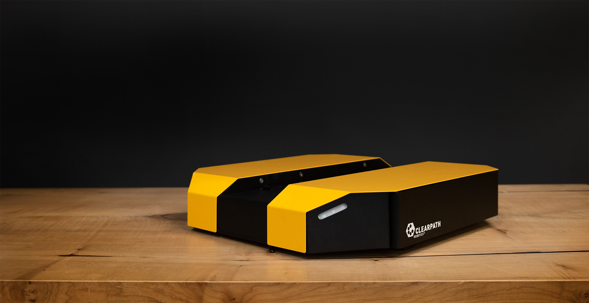

Dingo Tutorials
================

This package supplies Sphinx-based tutorial content to assist you with setting up and operating your Dingo_ mobile robot. The tutorials topics are listed in the left column, and presented in the suggested reading order.

.. _Dingo: https://clearpathrobotics.com/dingo-indoor-mobile-robot/

.. Warning::
  These tutorials assume that you are comfortable working with ROS.  We recommend starting with our
  `ROS tutorial <./../ros>`_ if you are not familiar with ROS already.

:doc:`Simulation <Simulating>` is a logical place for most users to start, as this is universally applicable; understanding how to effectively operate Dingo in simulation is valuable whether you are in the testing phase with software you intend to ultimately deploy on a real Dingo, or you do not have one and are simply exploring the platform's capabilities.

:doc:`Driving <Driving>` covers how to teleoperate Dingo using the remote control, a well as safety procedures for operating the real robot. Anyone working with a physical robot should be familiar with this section.

:doc:`Navigation <Navigating>` is a follow-on to what is learned in the simulation tutorial, as navigation and map-making may be run in the simulated environment. However, this content is applicable to both the simulator and the real platform, if equipped with a laser scanner.

The remainder of the subjects are more applicable to the real robot, and have to do with configuring, using, and maintaining the platform. If you are a lab administrator rather than direct platform user, you may wish to skip the introductory chapters and jump straight to these ones.

.. toctree::
    :maxdepth: 0
    :caption: Dingo Overview

    Introduction <self>
    StatusIndicators

.. toctree::
    :maxdepth: 0
    :caption: Dingo ROS Packages

    CommonPackages
    DescriptionPackage

.. toctree::
    :maxdepth: 0
    :caption: Setting Up Dingo

    Installing
    Networking
    PairingController

.. toctree::
    :maxdepth: 0
    :caption: Using Dingo

    Driving
    Simulating
    Navigating

.. toctree::
    :maxdepth: 0
    :caption: Hardware Customization

    CustomComputer
    Payloads
    Manipulation

.. toctree::
    :titlesonly:
    :maxdepth: 0
    :caption: NVIDIA Jetson

    JetsonNano
    JetsonXavier

.. toctree::
    :titlesonly:
    :hidden:
    :caption: Other

    AdditionalSimulation