Installing a Jetson Nano
========================

Step 1: Open up Dingo
-----------------------

Start by removing Dingo's side panels, yellow cover plates, and removing the center channel covers.

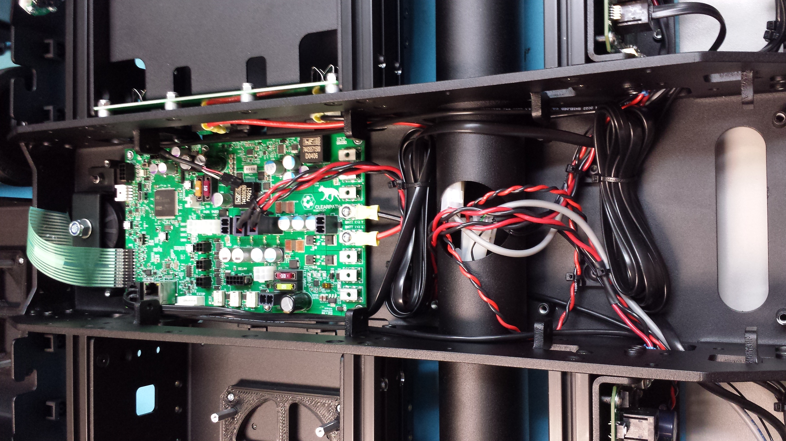

Step 2: Install the Nano
------------------------

Dingo includes pre-threaded mounting holes for the Jetson Nano.  We recommend using 20mm standoffs to raise the board.

.. image:: images/computer-bay.jpg
  :alt: Dingo's computer bay

Connect the Jetson's power cable to the 5V output from Dingo's MCU.

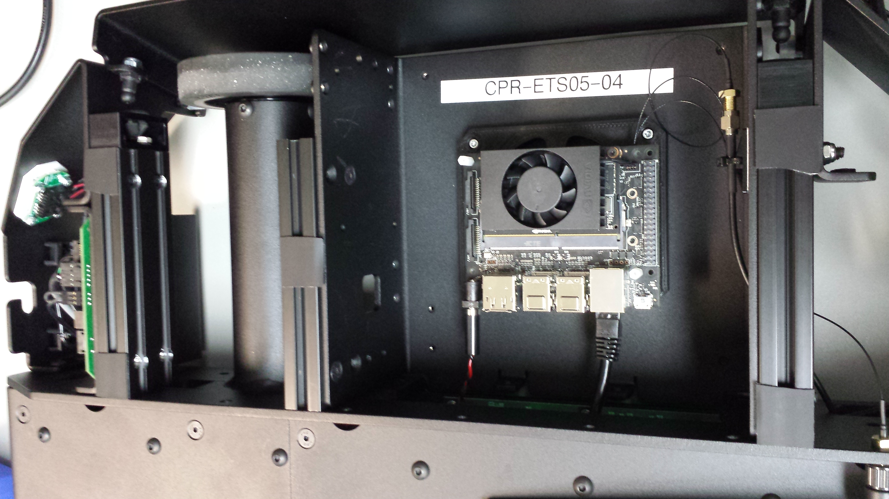

The ethernet port on the Nano will eventually need to be connected to the ethernet port of Dingo's MCU.  If you have
a network switch installed you can connect the MCU and the Nano to the switch.  Otherwise leave the MCU disconnected
for now so that the Nano's ethernet port can be used for downloading the software from the internet.

Step 3: Installing the Software
--------------------------------

Download the latest version of the `Nano SD Image <https://developer.nvidia.com/jetson-nano-sd-card-image>`_
Download the latest version of `Balena Etcher <https://www.balena.io/etcher/>`_

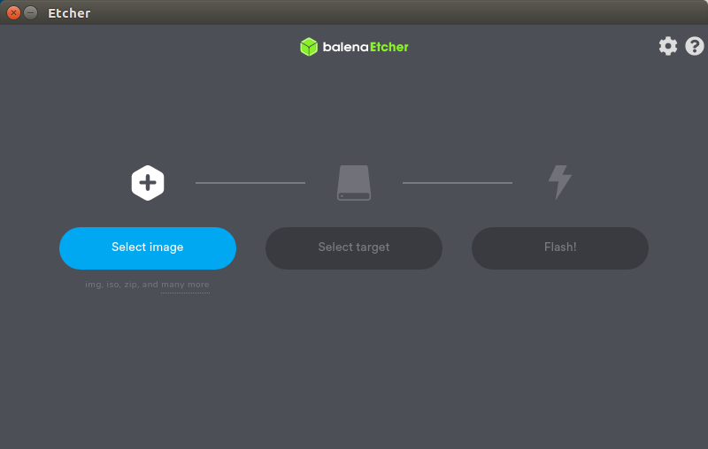

Use Etcher to flash the image onto your SD card

Once it is installed, connect the nano to a keyboard, monitor, and power supply.  Ubuntu needs to be setup first.  Agree to the Terms

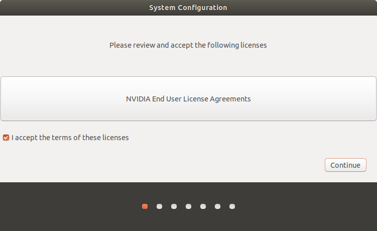

Select your language.

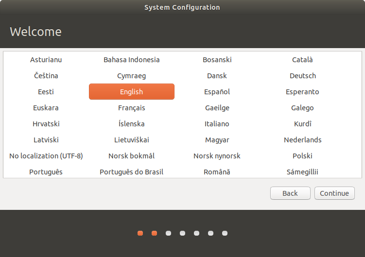

Select your keyboard layout.

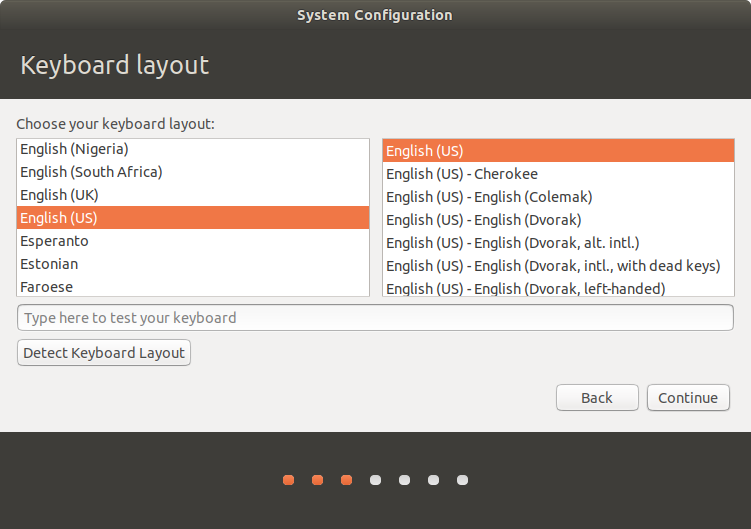

Select your locaiton.

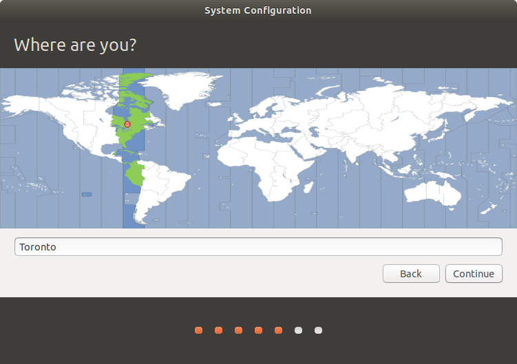

Pick a hostname, username, and password for the machine.

.. note::

    For compatibility with older versions of the Jetson Nano software, set the username and password to ``nvidia``.
    To standardize with other Clearpath Robotics products, set the username to ``administrator`` and the password to
    ``clearpath``.

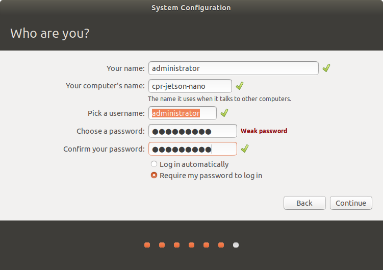

Specify the size for the partition.  The default size should fill the whole SD card.  Make sure it matches the maximum
possible size, unless you have other plans for that space.

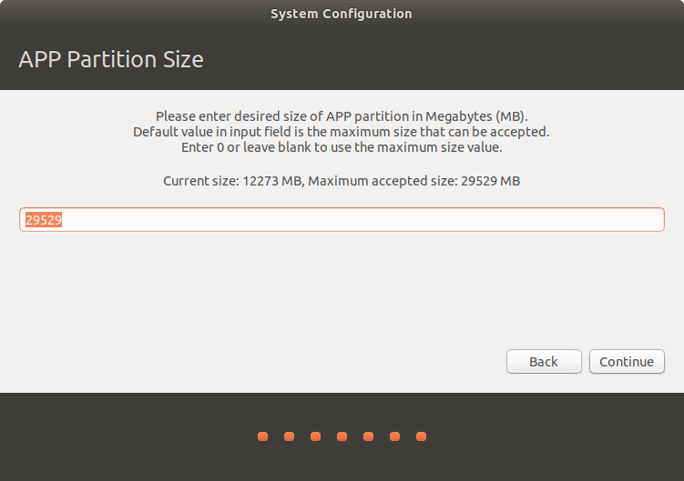

It will install the remainder of the required default packages.

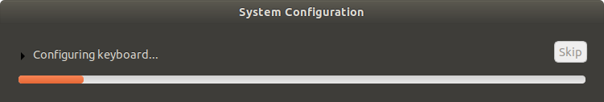

Once the OS has been written to the Nano, log into it and run the following commands to configure it for use with Dingo:

.. code-block:: bash

    wget -c https://raw.githubusercontent.com/clearpathrobotics/ros_computer_setup/main/install.sh && bash install.sh

.. note::

    If ``curl`` is not installed on your Jetson by default you can install it by running ``sudo apt-get install curl``

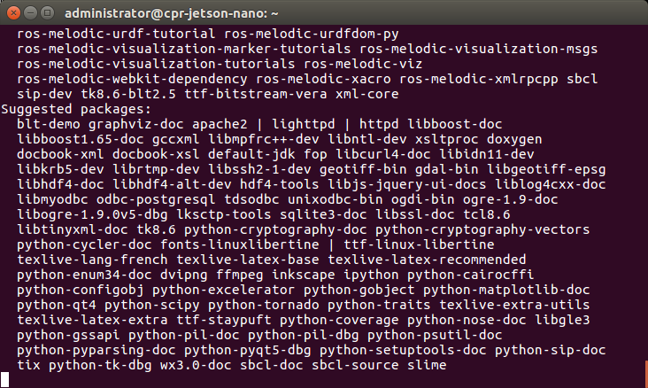

These commands will download and install ROS along with the necessary APT packages to get Dingo up and running.  Depending on your network speed it may take a long time for everything to install.  Reboot the Nano after these commands are done to complete the configuration.

When the Jetson starts up again, it should be connected to the Dingo. To see that the Dingo is connected by opening a terminal and executing "rostopic echo /status". You should see a 1hz message containing the Dingo's diagnostic information.

Your Jetson Nano should now be configured to operate as the Dingo's main PC.